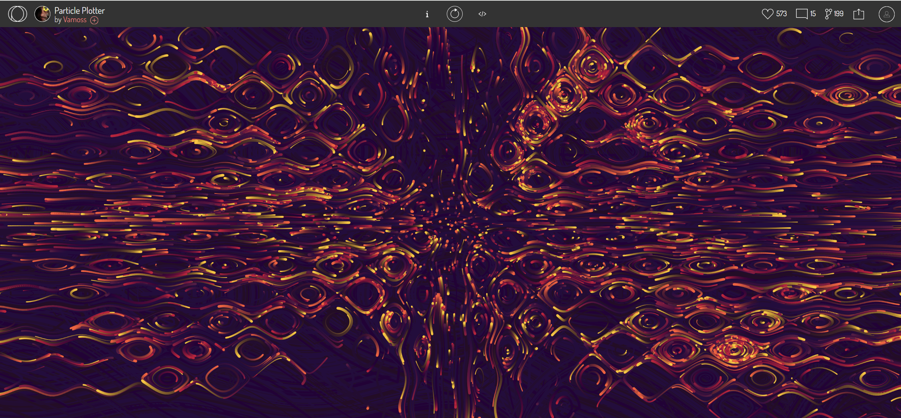

#Part 1
I found an interesting interactive rendering on the openprocessing website. It generates particles with different motion trajectories by clicking on the screen, and these particles move according to changes in a certain dynamic field. The effect uses a series of mathematical functions to generate different curves, giving a dynamic, complex visual effect. I wanted to add this effect to Edvard Munch's work "The Scream". The work is mainly curved, adding dynamic change effect will make the work more lively and interesting.

#Part 2
Make use of blobs, which is an array that stores all the generated particles. Each particle has properties such as position, speed, size, color, and so on.
variation is used to switch variables of different dynamic field functions, which determine how particles move. The program automatically changes the variation every once in a while, changing the particle's trajectory.
The variables xScale, yScale, and centerX, centerY define the coordinate system of the particle, mapping the coordinates of the screen to different scales to facilitate the calculation of the particle's motion.